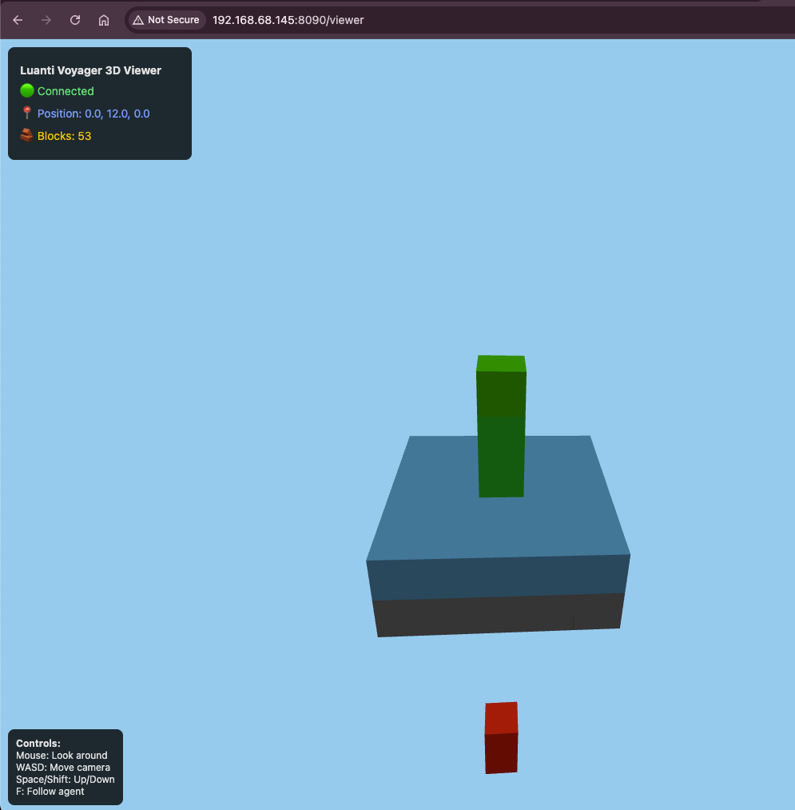

# Luanti Voyager

<div align="center">

**Let's teach AI to dream in blocks!**

*An open playground where language models learn to survive, build, and thrive in voxel worlds*

[](https://opensource.org/licenses/MIT)
[](https://github.com/toddllm/luanti-voyager)

</div>

---

## 🚀 What's This About?

Imagine an AI that starts knowing nothing about the voxel world, then gradually learns to chop trees, craft tools, build shelters, and maybe even create things we never imagined. That's Luanti Voyager - a wild experiment in letting language models loose in the open-source Luanti sandbox.

Inspired by MineDojo's Voyager but built on fully open foundations, this project is whatever we make it together!

### The Dream

✨ **Agents that learn by doing** - No pre-programmed behaviors, just curiosity and code
🧠 **Any LLM, any approach** - OpenAI, Anthropic, local models, or something completely new
📚 **Growing skill libraries** - Each agent builds on what came before
🔓 **Radically open** - Fork it, break it, make it weird
🚀 **Fast experimentation** - Craftium gives us thousands of steps per second

## 🎮 Why This Matters

### The Moment is Now

- **Voyager showed the way** - LLMs can actually play and learn
- **Luanti is ready** - Mature, moddable, and truly open
- **Craftium unlocked speed** - Research-grade performance in a voxel world
- **The community is hungry** - People want to build crazy AI experiments

### Why Open Source Changes Everything

- **No corporate overlords** - We own this completely
- **Mod anything** - The engine itself is our playground
- **Run anywhere** - Your laptop, a Pi cluster, or the cloud
- **Share everything** - Skills, worlds, and wild ideas

## 🏗️ How It Works (The Simple Version)

```
Luanti World ←→ Craftium Magic ←→ Your Agent's Brain
```

The agent sees the world, thinks about what to do (using whatever LLM you want), tries stuff, and remembers what worked. That's it!

### The Fun Parts

🌍 **World Interface** - Your agent sees blocks, entities, inventory
🤔 **Brain Options** - Any LLM, any prompting strategy, any crazy idea
🎮 **Actions** - Move, dig, place, craft, and whatever else we dream up
💾 **Memory** - Save skills, share with others, build on previous work

## 🖼️ 3D Viewer Interface



*3D Viewer showing agent exploring terrain with static test blocks*

The real-time 3D viewer displays the agent's world view using structured data re-rendering (similar to Mindcraft's approach). It shows blocks, agent position, and exploration in real-time without screen capture.

## 🚀 Jump In!

### The Basics

```bash
# Grab the code
git clone --recursive https://github.com/toddllm/luanti-voyager.git
cd luanti-voyager

# Set up Python (however you like)
python -m venv venv
source venv/bin/activate

# Install stuff
pip install -r requirements.txt

# Run your first agent!
python -m luanti_voyager.main
```

That's it! The agent will start exploring. Want to use GPT-4? Set your API key. Want to use a local model? Go for it. Want to try something completely different? Please do!

### Make It Your Own

- **Change the world**: Flat, mountains, custom, whatever
- **Change the brain**: Different LLMs, prompting strategies, or even non-LLM approaches
- **Change the goals**: Survival, building, art, chaos
- **Change everything**: This is YOUR experiment

## 🗺️ Where We're Going

### Right Now - Get It Working
- [x] **Real-time 3D viewer** - Working Three.js visualization with WebSocket streaming
- [x] **Agent exploration** - Bot moves, teleports, and explores world via file-based commands  
- [x] **Block detection** - Agent perceives nearby blocks and reports world state
- [x] **Web interface** - Live agent monitoring and 3D visualization at localhost:8090
- [x] **Screenshot workflow** - Paste interface for rapid documentation (paste → describe → save)
- [ ] **Terrain generation** - Replace void world with actual Luanti terrain
- [ ] **LLM integration** - Connect agent decisions to language model reasoning
- [ ] **Basic survival** - Agent learns to avoid death and basic world interaction
- [ ] **Skill memory** - Save and reuse learned behaviors

### Soon - Make It Smart
- [ ] Better LLM integration
- [ ] Skill sharing between agents
- [ ] Learning from failure
- [ ] Community challenges

### Eventually - Make It Amazing
- [ ] Multi-agent societies
- [ ] Agents that mod the game
- [ ] Completely new architectures
- [ ] Things we haven't imagined yet

### Always - Keep It Fun
- [ ] Wild experiments
- [ ] Silly projects
- [ ] Unexpected discoveries
- [ ] Community first

## 🛠️ Build With Us

### Code Structure (Rough Sketch)

```
luanti-voyager/
├── luanti_voyager/      # The main code
├── worlds/              # Interesting places to explore
├── skills/              # What agents have learned
├── experiments/         # Your wild ideas
└── whatever/            # Seriously, add whatever you want
```

### How to Contribute

**Literally anything helps:**
- 💡 Share a crazy idea
- 🐛 Break something and tell us about it
- 🎨 Make it beautiful
- 🧪 Try weird experiments
- 📹 Record your agent doing something cool
- 🗣️ Tell your friends

**No contribution is too small or too weird!**

## 📊 How We'll Know It's Working

- [x] **Real-time visualization works** - 3D viewer shows agent movement and world state ✅
- [x] **Agent moves autonomously** - Bot explores and responds to environment ✅
- [x] **Development workflow is smooth** - Screenshot paste and documentation tools work ✅
- [ ] **It survives longer than 5 minutes** - Basic survival and safety behaviors
- [ ] **It learns something new** - Demonstrates skill acquisition and memory
- [ ] **It surprises us** - Emergent behaviors we didn't program
- [ ] **Someone says "whoa, I didn't expect that"** - The ultimate test
- **The community gets excited**

We'll figure out proper benchmarks later. For now, let's just build cool stuff!

## 🌟 Join the Party

- **GitHub**: This is home base - star, fork, break things
- **Discussions**: Share your experiments and ideas
- **Matrix**: `#luanti-voyager:matrix.org` for real-time chat
- **Your Blog/Twitter/YouTube**: Show off what you build!

## 📚 Inspiration & Credit

We're standing on the shoulders of giants:
- [Voyager](https://github.com/MineDojo/Voyager) - Showed us LLMs can play
- [Craftium](https://github.com/mikelma/craftium) - Made it fast
- [Luanti](https://github.com/luanti/luanti) - Gave us the perfect playground
- You - For being here and making this real

## 🔮 Vision Roadmap: From Symbolic to Visual

*Understanding how Luanti Voyager approaches visual perception*

### The Mindcraft Model

Following Mindcraft's proven approach, we implement **structured data re-rendering** rather than screen capture:

| Layer | Technology | Purpose |
|-------|------------|---------|
| **Game API** | Luanti mod system | Provides structured events for chunks, blocks, entities, inventory - no pixels required |
| **3D Viewer** | Three.js + WebSocket | Real-time browser visualization that re-renders the agent's world from structured data |
| **Agent Integration** | Python WebSocket server | Streams game state updates to create live "prismarine-viewer" style experience |

**Key insight:** This is not screen capture of the game client - it's a real-time 3D re-render built from protocol data the agent already receives.

### Current Implementation (Phase 1)

✅ **Symbolic-First Architecture**
- Rich game state: position, inventory, nearby blocks (5x5x5 radius)
- WebSocket streaming to Three.js viewer at `http://localhost:8090/viewer`
- Real-time agent visualization with block rendering
- Follow-cam and free-look camera controls

✅ **Why This Works**
- Keeps prompts small (JSON not JPG)
- Avoids vision model latency/cost
- Provides contributors with live 3D browser window
- Identical to how Minecraft Voyager operates (no visual input)

### Future Upgrade Path (Phase 2+)

When ready for multimodal capabilities:

- **Option A**: Enhance current viewer to capture frames programmatically
- **Option B**: Add Luanti client screenshot API integration  
- **Option C**: Integrate with GPT-4V/LLaVA-Next for pixel understanding

The architecture supports both approaches seamlessly - visual input becomes just another `observation_space` key.

### Try It Now

```bash
# Start the integrated experience
python -m luanti_voyager.main --port 40000

# Open browser to see live 3D view
open http://localhost:8090/viewer
```

*Watch your agent explore in real-time 3D while staying symbol-first for efficiency.*

## 📄 The Legal Stuff

MIT License - basically do whatever you want! See [LICENSE](LICENSE) for the formal version.

---

<div align="center">

**This is just the beginning.**

*What happens when we let AI truly explore?*

*Let's find out together.*

🎮 🤖 🚀

</div>