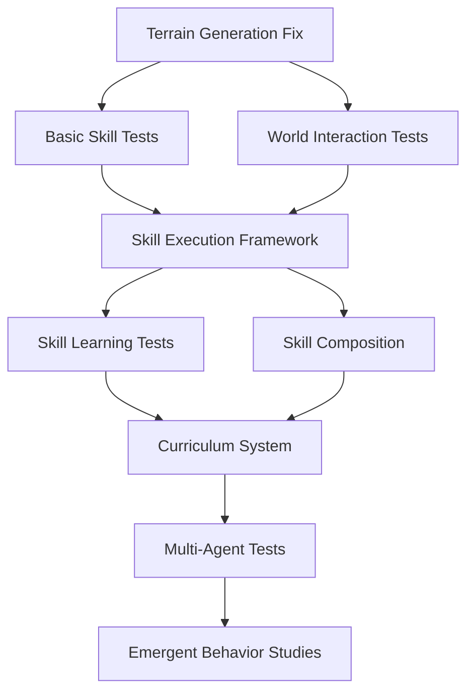

# 📋 Task-Based Development Guide

> **Core Principle**: We work on tasks, not timelines. Each task should be self-contained, testable, and valuable on its own.

## 🎯 How We Work

### Task Structure
Every task should have:
- **Clear Goal**: What does "done" look like?
- **Dependencies**: What must exist before this task can start?
- **Test Criteria**: How do we verify it works?
- **Value Delivered**: Why does this matter?

### No Deadlines, Only Dependencies
```
❌ "Complete by next week"
✅ "Can start after terrain generation works"

❌ "Sprint 3 deliverable"  
✅ "Unlocks skill composition feature"
```

## 🧪 Testing Framework (Core Infrastructure)

### Why Testing First?
- **Confidence**: Know when something works
- **Regression Prevention**: Don't break existing features
- **Documentation**: Tests show how to use features
- **Contribution Quality**: PRs must pass tests

### Test Categories

#### 1. **Unit Tests** - Individual Components
```python
# test_memory.py
def test_skill_memory_persistence():
    """Memory should persist across agent restarts"""
    memory = SkillMemory("TestBot")
    memory.remember_strategy("test", "strategy")
    
    # Simulate restart
    memory2 = SkillMemory("TestBot")
    assert memory2.get_best_strategies("test") == ["strategy"]
```

#### 2. **Integration Tests** - Components Working Together
```python
# test_llm_agent_integration.py
async def test_llm_makes_decisions():
    """LLM should generate valid actions from world state"""
    agent = VoyagerAgent(llm_provider="ollama")
    action = await agent._decide_action()
    assert action["type"] in ["move", "teleport", "dig", "place"]
```

#### 3. **Behavior Tests** - Agent Capabilities
```python
# test_agent_behaviors.py
async def test_agent_escapes_void():
    """Agent should teleport when stuck in void"""
    agent = create_test_agent()
    place_agent_in_void(agent)
    
    action = await agent._decide_action()
    assert action["type"] == "teleport"
    assert action["reason"].contains("void")
```

#### 4. **Skill Tests** - Learned Behaviors
```python
# test_skill_execution.py
async def test_generated_skill_safety():
    """Generated skills should not execute dangerous code"""
    malicious_code = "import os; os.system('rm -rf /')"
    
    skill_executor = SkillExecutor()
    with pytest.raises(ValueError, match="Invalid or unsafe"):
        skill_executor.validate_skill_code(malicious_code)
```

### Test Infrastructure

```python
# conftest.py - Shared test fixtures
import pytest
from luanti_voyager.test_utils import MockWorld, MockAgent

@pytest.fixture
def mock_world():
    """Provides a simulated world for testing"""
    return MockWorld(terrain="flat", size=(100, 100, 100))

@pytest.fixture  
def test_agent(mock_world):
    """Provides a test agent in mock world"""
    return MockAgent(world=mock_world, spawn_pos=(50, 10, 50))
```

### Continuous Testing
```yaml
# .github/workflows/test.yml
on: [push, pull_request]
jobs:
  test:
    runs-on: ubuntu-latest
    steps:
      - uses: actions/checkout@v3
      - name: Run Unit Tests
        run: pytest tests/unit/
      - name: Run Integration Tests  
        run: pytest tests/integration/
      - name: Run Behavior Tests
        run: pytest tests/behaviors/
```

## 📊 Task Dependency Graph



## 🎯 Current Task Pool

### Immediate Tasks (No Dependencies)

#### Task: Create Test Framework
- **Goal**: Pytest-based testing for all components
- **Test Criteria**: Can run `pytest` and see all tests pass
- **Value**: Enables confident development

#### Task: Mock World System
- **Goal**: Simulate Luanti world without running server
- **Test Criteria**: Can test agent behaviors in isolation
- **Value**: Fast testing, no server needed

#### Task: Import Existing Worlds
- **Goal**: Load community Luanti worlds for testing
- **Test Criteria**: Agent can explore imported world
- **Value**: Immediate terrain for testing

### Blocked Tasks (Have Dependencies)

#### Task: Skill Execution Framework
- **Dependencies**: Test framework, Mock world
- **Goal**: Agents generate and execute code
- **Test Criteria**: Agent learns and executes 5 different skills
- **Value**: Core differentiator, enables learning

#### Task: Curriculum Design
- **Dependencies**: Skill execution, Basic skills work
- **Goal**: Structured learning progression
- **Test Criteria**: Agent progresses through 10 curriculum levels
- **Value**: Guided learning, measurable progress

## 🔄 Task Lifecycle

1. **Proposed**: Issue created, discussing approach
2. **Designed**: Approach agreed, tests defined
3. **In Progress**: Someone actively working
4. **Testing**: Implementation complete, tests running
5. **Review**: Code review, documentation check
6. **Complete**: Merged, documented, tested

## 📝 Task Templates

### Feature Task Template
```markdown
## Task: [Name]

**Goal**: What are we building?
**Dependencies**: What must exist first?
**Test Criteria**: How do we know it works?
**Value**: Why does this matter?

### Design
- Approach description
- Key decisions
- Alternative considered

### Tests Required
- [ ] Unit tests for components
- [ ] Integration tests
- [ ] Behavior tests
- [ ] Documentation

### Definition of Done
- [ ] All tests pass
- [ ] Documentation updated
- [ ] Code reviewed
- [ ] Example provided
```

### Research Task Template
```markdown
## Research: [Topic]

**Question**: What are we trying to learn?
**Dependencies**: What knowledge/code needed?
**Success Criteria**: What answers do we need?
**Application**: How will we use this?

### Experiments
1. Experiment description
2. Metrics to collect
3. Analysis approach

### Deliverables
- [ ] Research document
- [ ] Proof of concept code
- [ ] Recommendations
- [ ] Follow-up tasks
```

## 🤝 Human-AI Collaboration

### Task Assignment
- **Humans excel at**: Architecture, design decisions, creativity
- **AI excels at**: Implementation, documentation, testing
- **Together**: Review, iterate, improve

### Collaboration Patterns
```python
# Human defines interface
class SkillExecutor:
    def execute(self, skill_name: str) -> bool:
        """Human defines what we need"""
        pass

# AI implements
class SkillExecutor:
    def execute(self, skill_name: str) -> bool:
        """AI implements the details"""
        # Detailed implementation...
```

### Code Review Process
1. AI generates implementation
2. Human reviews design decisions
3. AI adds tests and documentation
4. Human approves or requests changes
5. Both iterate until quality met

## 📈 Progress Tracking

### Task Metrics
- **Velocity**: Tasks completed per week (not time-based!)
- **Quality**: Test coverage, bug reports
- **Impact**: Features unlocked, papers enabled

### No Burndown Charts!
We track:
- ✅ What's possible now
- 🚧 What's blocked and why
- 🎯 What unlocks the most value

## 🎯 Next Tasks to Pick Up

### For Newcomers
1. **Add unit tests for existing code**
2. **Document undocumented functions**
3. **Create example scripts**

### For AI Contributors  
1. **Implement test fixtures**
2. **Generate skill examples**
3. **Write integration tests**

### For Experienced Contributors
1. **Design skill execution sandbox**
2. **Create curriculum framework**
3. **Research hierarchical planning**

---

**Remember**: Every task should make the next person's job easier. We're building a platform for the long term, not rushing to a deadline.